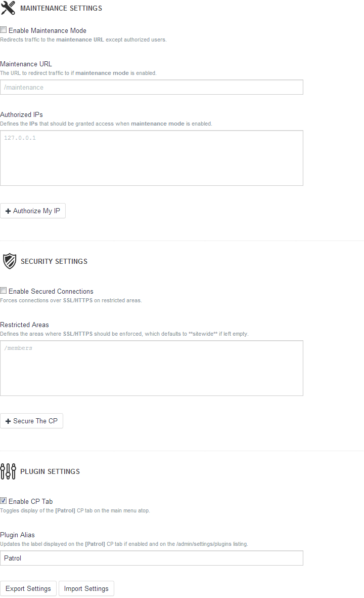

## Patrol 0.9.4
Patrol simplifies **maintenance mode** and **SSL enforcement** for sites built with [Craft](http://buildwithcraft.com)

### TL;DR

### Requirements
- Craft 1.3 build 2415

### FAQ

---
#### @Maintenance Mode
##### How do I give users access when maintenance mode is enabled?
- You can add their **IP** to the _Authorized IPs_ list
- Logged in users with **admin** permissions have full access by default

##### How do I authorize [BeanStalk](http://beanstalkapp.com) so I can deploy if maintenance mode is enabled?
1. Find the IP range for **BeanStalk** or any other service: `50.31.189.108 – 50.31.189.122`
2. Add a partial IP to the _Authorized List_: `50.31.189.1 or 50.31.189.1**`

##### Will IP authentication work if my site is behind [CloudFlare](http://cloudflare.com)?
- **Yes**, CloudFlare provides the user's IP via a header that Patrol understands

##### Doesn't Craft have a maintenance mode setting?
- **Yes**, but it's meant for internal use only to handle updates

#### @Security
##### How do I force SSL on the CP?
- Click on the **Secure The CP** button and save your settings
- Add `/{cpTrigger}` to the _Restricted Areas_

##### How do I force SSL on my whole site?
- Leave the _restricted areas_ blank

##### How do I force SSL on a specific URL, like my login page?
- You can add something like `/members/login` to the _restricted areas_

##### How do I force SSL on a specific section of the my site, like my members section?
- You can add the section URL `/members` and URLs on that scope will be restricted

### Notes
- If no **maintenance URL** is set, Patrol will default to throwing a **403**
- The CP is accessible even if **maintenance mode** is turned on to avoid lockouts
- Settings are exported in `JSON` format

### Beta Testers
Thank you for helping me out, you will be the first to get the production ready version.

Please keep the following in mind as you test Patrol...

- Download the [Latest Release](https://github.com/selvinortiz/craft-patrol/releases/tag/v0.9.4) rather than cloning the repo
- Do not distribute the source code without approval from yours truly
- Report all bugs and/or questionable features directly to me or by creating an issue within this repo
- Get in touch with me via twitter [@selvinortiz](http://twitter.com/selvinortiz) or via email selvin@selvin.co
