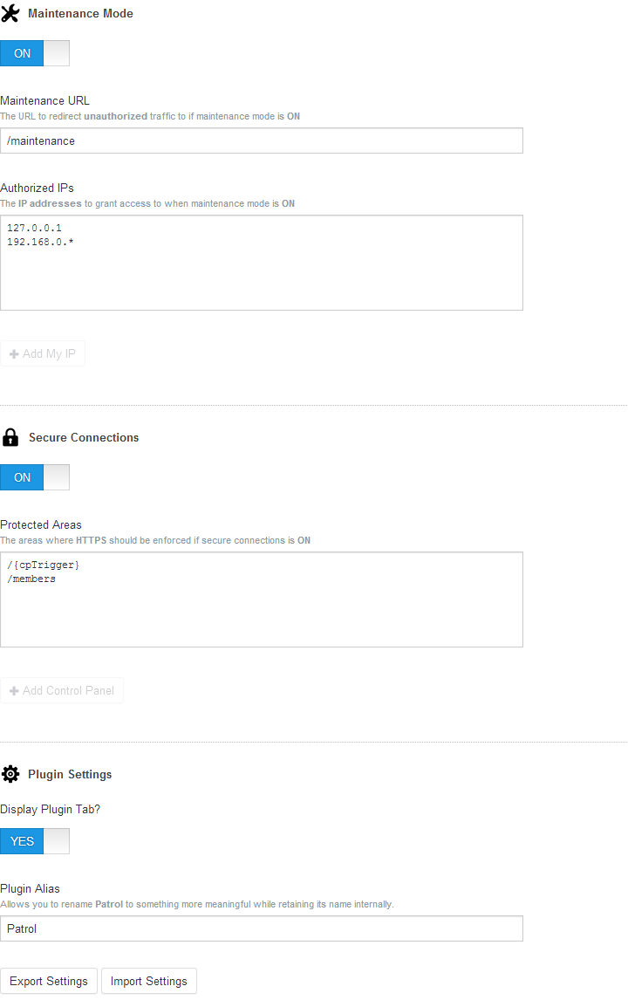

## Patrol 0.9.6
*by* [Selvin Ortiz](http://twitter.com/selvinortiz)

----
### Description
Patrol simplifies **maintenance mode** and **secure connections** for sites built with [Craft](http://buildwithcraft.com)

Giving you fine grain control over your **force SSL** settings and the easy to set up **down for maintenance** workflow.

----
### Features
- Handle maintenance mode with ease
- Force SSL on specific pages, areas, or globally
- Uses IP based authentication to bypass maintenance mode
- Allows IP based authentication even if behind *CloudFlare*
- Allows logged in admins to bypass maintenance mode
- Disable SSL per environment by adding a *patrolSettings* array with `forceSsl` set to `false` to your `general.php`

----
### Download Notes
You must download the [latest release](https://github.com/selvinortiz/craft.patrol/releases) with the following name pattern `patrol.v*.*.*.zip`

The official release is the only distribution meant for production and it is required when requesting support or reporting a bug.

### Requirements
- Craft 1.3 build 2415

### Installation
1. Download the [latest release](https://github.com/selvinortiz/craft.patrol/releases) with the following name pattern `patrol.v*.*.*.zip`
2. Extract the archive and place `patrol` inside your `craft/plugins` directory
3. Adjust file permissions as necessary

### Setup
The **FAQ** should get you started and the screenshot below will give you an idea of what options are available.

### Notes
- If no **maintenance URL** is set, Patrol will default to throwing a **403** server error
- The **Control Panel** is accessible even if **maintenance mode** is **ON** to avoid **admin** lockouts
- Settings are exported in `JSON` format

### FAQ

#### 1. How do I give users access when maintenance mode is ON?
- You can add their **IP** to the list of _Authorized IPs_
- Logged in users with **admin** permissions have full access by default

#### 2. Will IP authentication work if my site is behind [CloudFlare](http://cloudflare.com)?
- **Yes**, CloudFlare provides the **requesting IP** via a header that Patrol understands

#### 3. Doesn't Craft have a maintenance mode setting?
- **Yes**, but it's meant for internal use only to handle updates

#### 4. How do I force secure connections on the Control Panel?
- Click on the **Add Control Panel** button
- Add `/{cpTrigger}` to the list of _Protected Areas_

##### 5. How do I force secure connections on my whole site?
- Leave the _Protected Areas_ empty
- Add a forward slash `/` to the list of _Protected Areas_

##### 6. How do I force secure connections on a specific URL, like my login page?
- You can add something like `/members/login` to the _Protected Areas_

##### 7. How do I force secure connections on a specific section, like the members area?
- You can add the section URL `/members` and URLs on that scope will be protected as well

### Help & Feedback
If you have questions, comments, or concerns feel free to reach out to me on twitter [@selvinortiz](http://twitter.com/selvinortiz)

### License
**Patrol** for _craft_ is open source software licensed under the [MIT License](http://opensource.org/licenses/MIT)

