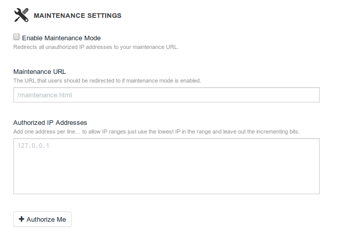
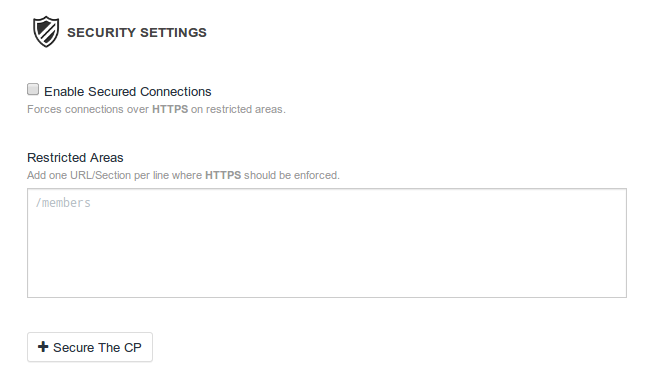
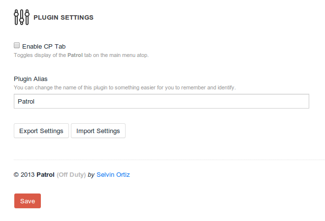

## Patrol 0.8.0
Patrol aims to improve deployment workflow and security for sites built with [Craft](http://buildwithcraft.com)

## TL;DR
**Maintenance:** Allows you to display a splash page to let users know that your site is **down for maintenance** while giving authorized users full access to the front-end and CP.

**Security:** Allows you to force **SSL** on specific areas of your site, giving you fine grain control without messing with _htaccess_ rules.

**Designer Friendly:** Patrol solves two problems often faced by developers but it attempts to do so in a designer friendly way by simplifying the terminology used and providing helpful hits through out the interface.
Additionally, settings **export/import** _(JSON)_ functionality is available so that they can be shared between users or sites.

## NOTES
1. The CP is accessible even if **maintenance mode** is turned on to avoid admin lockouts.
2. Patrol will og _off duty_ if **devMode** is on regardless of its settings.
